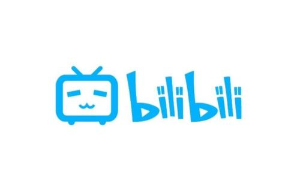
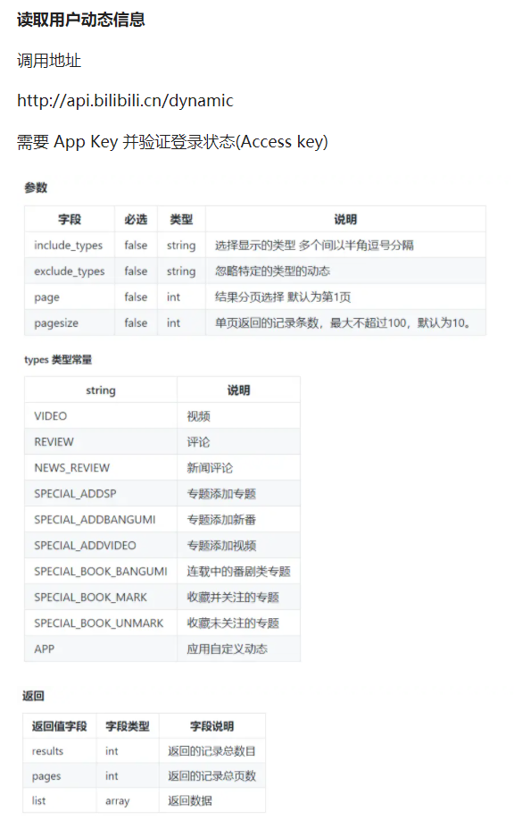
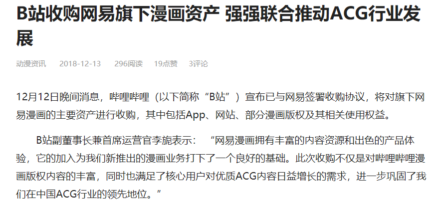
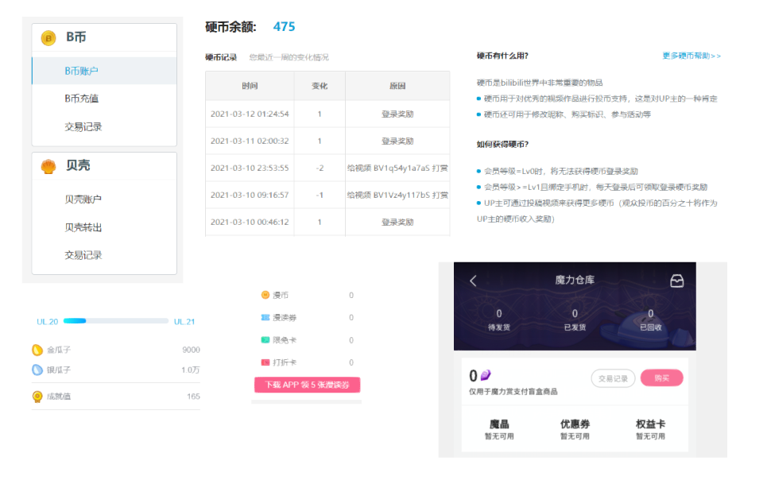
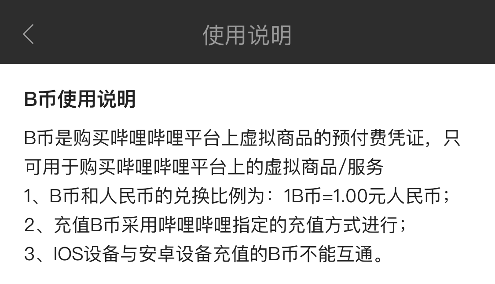

# 哔哩哔哩应用系统分析

[TOC]

## 1 小组成员

* 181250013 陈思文
* 181250019 陈子合
* 181250023 戴祺佳
* 181250102 孟俊豪

## 2 调研主题

主题选择：***1. 日常的应用系统中的烟囱应用或多屏应用，并试分析其数据冗余或数据不一致性的问题。***

​		在本次集成场景调研作业中，本组将以哔哩哔哩应用系统（下文简称B站）为分析对象，关注其作为烟囱应用或多屏应用时所出现的数据冗余或数据不一致现象，并讨论这些问题背后的原因。主要内容大致为网页端与移动端的数据不一致、电视端的数据不一致、哔哩哔哩漫画的并购、哔哩哔哩应用系统下的虚拟货币体系和安卓端与IOS端不同的充值等、详情请见下文。



## 3 调研内容

### 3.1 网页端B站与移动端B站数据不一致

#### 3.1.1 问题描述

​		在哔哩哔哩应用系统中，网页端B站和移动端B站是两大主要组成部分。B站起源于网页，因此在发展过程中积攒了大量的网页端用户；同时，得益于移动互联网的迅猛发展，B站在移动端也受到了许多用户的喜爱。但是据我们的观察，用户在同时使用网页端B站和移动端B站时，却会出现数据不一致的问题。这些问题主要表现为用户的相关数据不同步。例如，当某用户在网页端查看B站动态之后，网页端B站将不再有新动态的提示（小红点）；然而，此后打开移动端B站时，用户仍然会收到新动态的提示信息（小红点），并且发现是在网页端B站已经浏览过的动态。此类数据不同步的问题将一定程度上影响用户的使用体验。

#### 3.1.2 原因讨论

​		我们认为造成B站在移动端和网页端数据不一致的原因可能是：

- 虽然两者大概率共用着同一个数据仓库，但是连接着移动端和网页端的输出接口可能并不同步，没有做到很好的同步更新。同时也可能存在着数据标准和口径不一致的问题，没有建立一个良好的数据中台。

- 网页端与移动端的本地数据是分离的，不能互相感知状态，每次在某一端登录时都只是携带用户的 AppKey 访问```http://api.bilibili.cn/dynamic```进行动态拉取，但不回复信息，服务器也不记录拉取状态，极有可能是状态数据的不同步导致了上述问题的发生。

  

### 3.2 web端B站与电视端B站数据不一致

#### 3.2.1 问题描述

​		随着智能电视的发展，多数公司都开发了旗下产品的电视端APP。其中，云视听小电视正是B站所对应的的电视端APP。但是，当用户在使用电视端B站的时候，经常会出现数据不一致的问题——首先，网页端和移动端共通的B站大会员（即VIP）并不与电视端互通，如若用户希望在电视端B站享受大会员的视听体验，需要再度充值成为电视端大会员；其次，电视端B站的个人数据往往会出现缺失问题，例如某用户实际关注了16位其他用户，而从电视端查看时，却只能查看到该用户仅关注了10位其他用户，诸如此类的还有用户的历史浏览、动态等；同时电视端app无法呈现B站视频弹幕的内容；最后同时也是最重要的一点，电视端B站相比较于网页端和移动端在投稿视频和番剧上存在缺失，这就意味着，用户有时并不能使用电视端B站观看自己想要观看的视频，从而降低了电视端B站的使用体验。

#### 3.2.2 原因讨论

​		我们认为造成B站电视端与移动端出现多种不一致的原因如下：

- 弹幕：电视端的云视听小电视采用DLNA等流媒体传输播放协议而非网页端和移动端的视频源 + HTML5播放器技术，技术上不支持弹幕功能。另外B站获得的网络经营牌照为视听节目，相比斗鱼虎牙等直播平台，B站在弹幕功能上会受到监管部门的压力。
- 大会员：电视软件归我国广播电视体系下的IPTV业务方进行审批监管，需要有广电媒体合作方才有资格上电视，云视听小电视就是B站与南方新媒体合作取得的广电播放资格。故按照规定会员处于独立状态，不过提供了web端大会员的对应赠送与web端大会员的升级以减少不必要的矛盾与冲突。
- 视频与关注者缺失：TV端的内容必须经过文广等部门二次审核之后才能在“小电视”找到，互联网电视应用有自己的管理制度，只能批量陆续上架。


### 3.3 哔哩哔哩漫画

#### 3.3.1 问题描述

​		随着近些年来B站的发展，B站开始经营规划属于B站的漫画业务，即哔哩哔哩漫画。但在使用过程中我们发现哔哩哔哩漫画的数据与哔哩哔哩主站的数据有较多的不同，如需要在哔哩哔哩漫画购买漫币进而购买漫画阅读权，而哔哩哔哩动画的原有虚拟货币B币则不能在哔哩哔哩漫画使用，给用户带来了许多不便。

#### 3.3.2 原因讨论

​		我们认为造成哔哩哔哩漫画如此现状的原因如下：

- B站为了在漫画业务上快速起步，加之网易漫画的经营状况不佳有出手意愿，双方选择直接进行资产交易，B站购买了相关的主要资产并直接重开上线，大部分是直接继承的原有的网易漫画app功能，没有进行高质量的整合，只是简单实现了账号登录统一，导致数据的隔离与不良的用户体验。



### 3.4 B站应用系统下的虚拟货币体系

#### 3.4.1 问题描述

​		B站作为互联网社区，在这么多年的发展中逐渐形成了独特的虚拟货币体系。但在此过程中，货币并不是统一且规范的，例如哔哩哔哩直播打赏中使用的是“瓜子”，会员购的会员赏当中使用的是“魔晶”，B站主站直接充值购买的是“B币”，哔哩哔哩漫画购买漫画使用的是“漫币”，用来直接激励Up主创作的是“电池”，用来作为UP主收益结算货币的是“贝壳”等。在这样的货币体系下，除了B币可以单向购买其他虚拟货币以外，其他货币之间无法直接转换流通，导致了B站虚拟货币体系的混乱与不良的用户体验。

#### 3.4.2 原因讨论

​		我们认为造成B站应用系统虚拟货币体系如此现状的原因如下：

- 哔哩哔哩公司的业务扩展过程漫长，从最早的自制、盗版同人资源站转型成为 ”二次元“ 相关的全领域娱乐平台过程中经历了多次的业务扩张与转型，这些扩张和转型大多没有充分考虑到数据一致性与数据冗余。比如有可能是面对一个新领域直接建立一个新部门开展相关业务或开发软件系统，领域相关的软件系统建立后实行简单并入主系统，这种野蛮扩展的方式能够快速在 ”二次元“ 相关的各个领域达成先发优势，用B站较强有力的资本快速占领市场，但也为后来的数据不一致性埋下了祸根。



### 3.5 B站IOS端和非iOS端的支付体系存在差异

#### 3.5.1 问题描述

​		B站移动端Android版本于2012年02月正式上线，iOS版本于2012年9月5日正式上线。最初两者在功能上具有较大的差距，但在近十年的发展中，IOS端与非IOS端app的差距已经基本消除，尚且存在的便是两者在支付体系中的差异。主要体现为：
 - 一、在贝壳提现时，IOS端需要跳转到网页进行操作，且只能提现到绑定的银行卡。而非IOS端可以提现到支付宝或者绑定的银行卡。

 - 二、两者所充值的B币不能互通。这种差异导致了B站支付体系的混乱，便利程度下降。

   

#### 3.5.2 原因讨论

​		我们认为这种差异现象存在的原因可能是：

- 由于苹果的强势和相关政策，IOS平台会对IOS端用户的充值进行30%抽取，B站获得的实际利益会有所损失，可能存在故意引导用户不进行IOS端充值的意图。
- B站IOS端和安卓端所采用的本不是同一个数据仓库，两个系统可能只进行了账户数据的统一，但是在用户充值这方面由于抽成的存在，等量B币所带来的收益是不同的，简单的统一可能会带来财务上的问题，考虑到IOS端用户数量占小部分，便独立出来单独处理。